# LSTM, ARIMA, databases etc... specifications.
### Diagram of the database used

All data used in this project are private and property of TITSA (Transportes interurbanos de Tenerife S.A).
### Diagram of the LSTM used

# ARIMA Results
### Real case light bulbs 
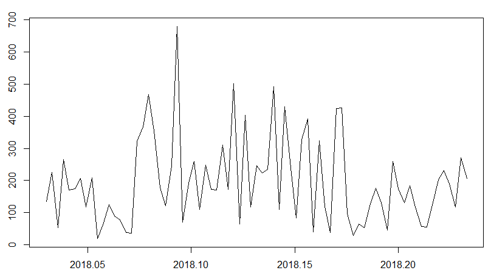
### Test case light bulbs 
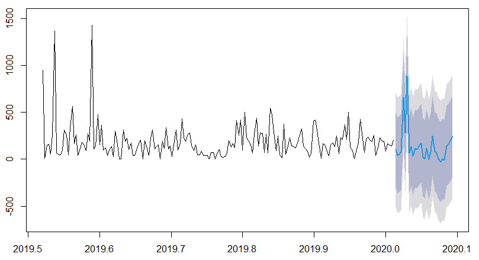
### 30 day forecast light bulbs 
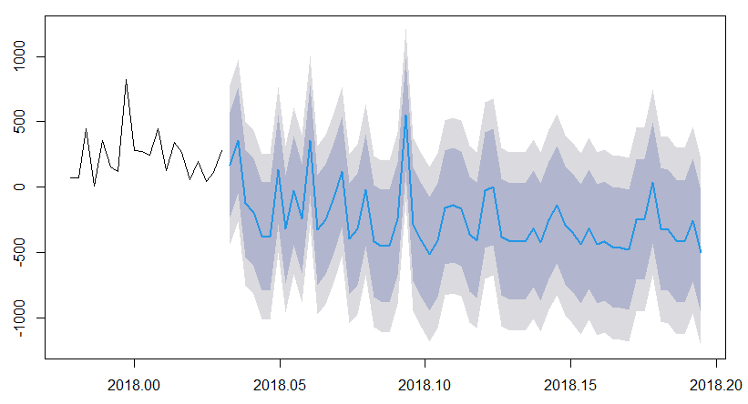
### Real case car decks 
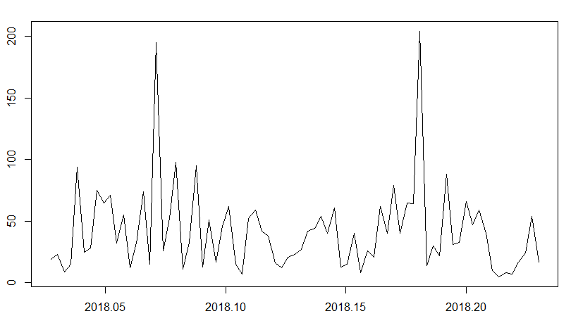
### Test case car decks  
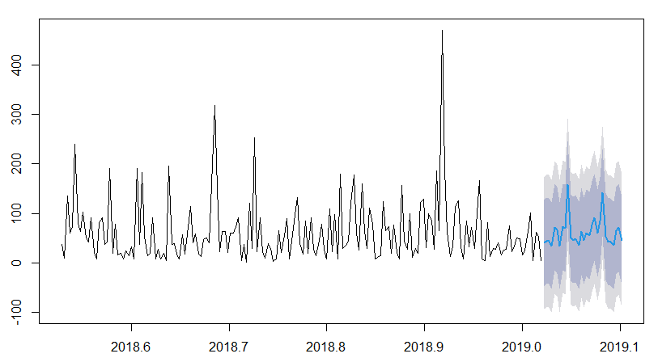
### 30 day forecast car decks 
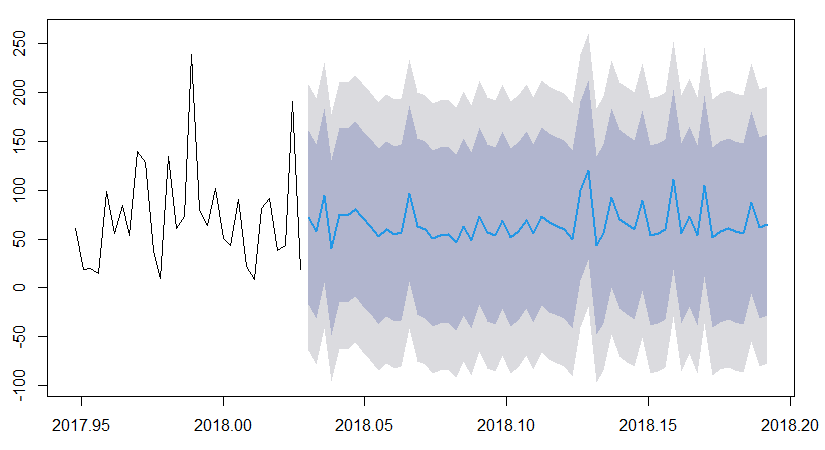
# LSTM Results
### Loss function in light bulbs
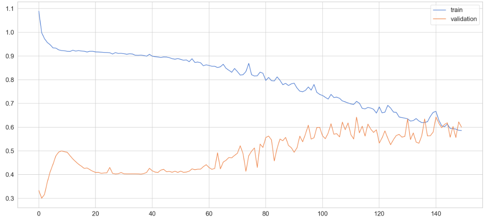
### Loss function in car decks
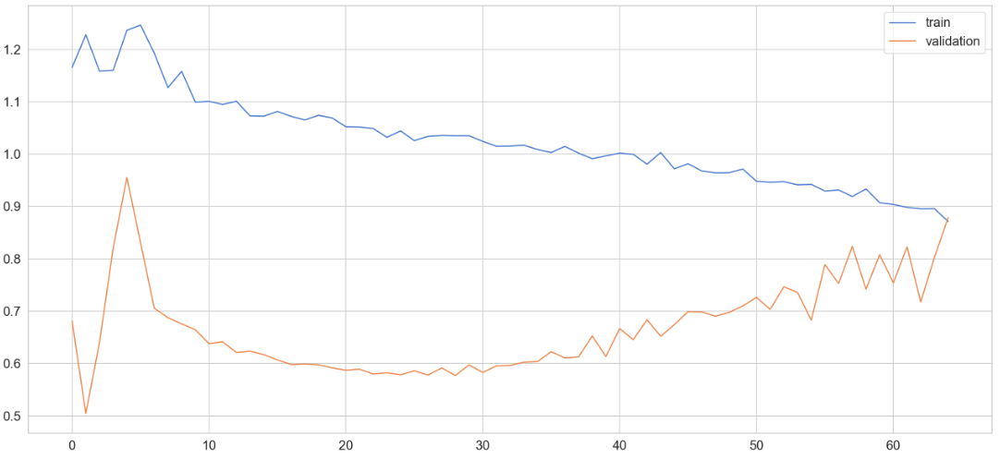
### Test vs Real in light bulbs
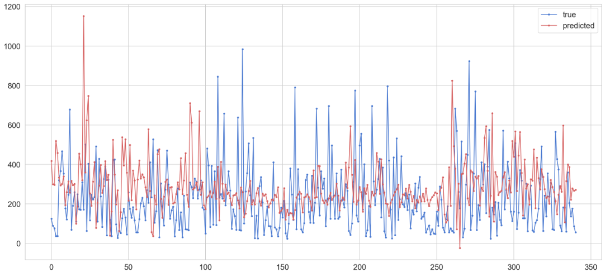
### Test vs Real in car decks
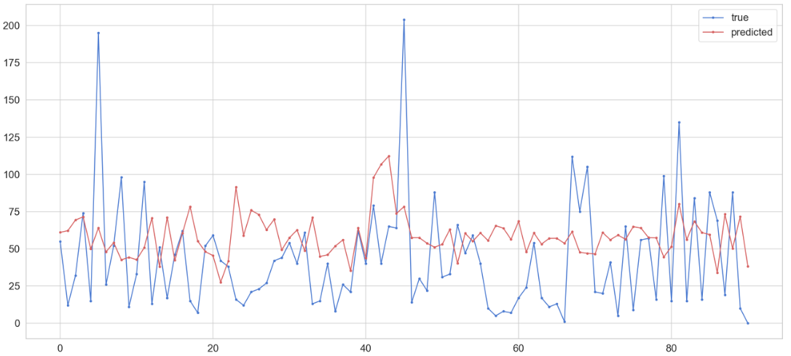
### Forecast light bulbs
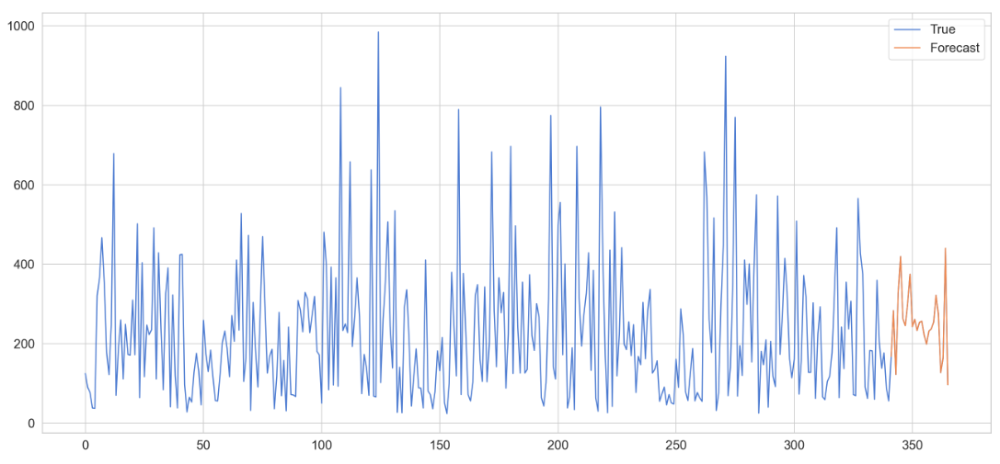
### Forecast car decks
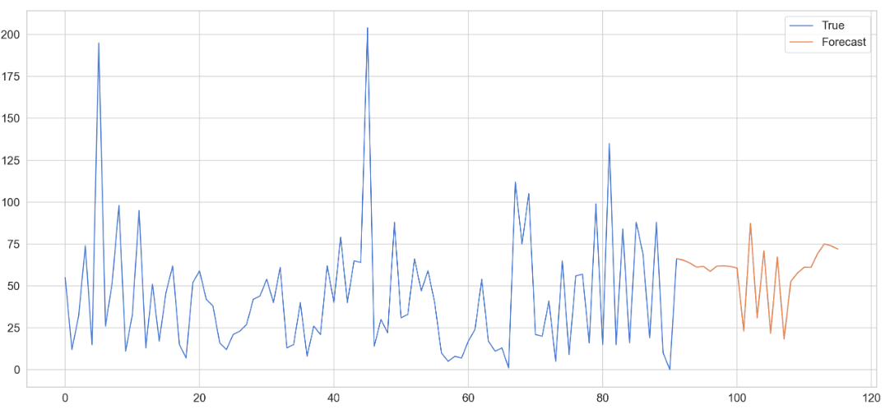
